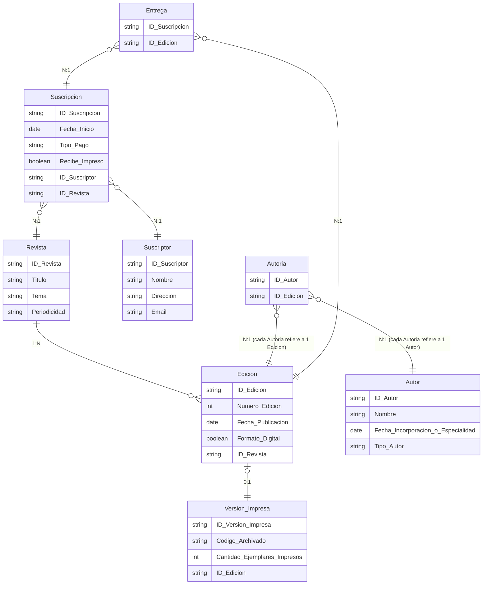

## Editorial Letras & Prensa

La editorial “Letras & Prensa” se dedica a publicar varias revistas mensuales especializadas en diferentes temas (moda, ciencia, gastronomía, etc.). Cada revista se publica con una periodicidad mensual y tiene un número único de edición, además de un título. Los clientes pueden suscribirse a una o varias revistas, y cada suscripción indica la fecha de inicio y el tipo de pago (anual, semestral, mensual). Las revistas a su vez pueden tener versiones digitales y/o impresas: en algunos casos, la versión digital puede existir sin que haya una versión impresa, y viceversa, aunque es común que ambas existan. Cada edición de la revista es preparada por un equipo editorial compuesto por redactores internos (empleados fijos de la editorial, con un código interno, nombre y fecha de contratación) y a veces por colaboradores externos (freelancers), que no son empleados fijos pero se registran con un identificador, su nombre y su área de especialidad. Un número de revista puede tener múltiples redactores internos y externos, y un redactor puede participar en múltiples números de diferentes revistas.

Además, la editorial mantiene un sistema de archivado: cada edición (ejemplar) físico impreso recibe un código de archivado único. Sin embargo, no todas las ediciones tienen ejemplar físico archivado: algunas solo existen en digital. Por otra parte, cada cliente suscrito puede recibir ejemplares físicos de forma opcional (indicado en su suscripción), que se envían a su dirección principal. Si el cliente no desea la versión impresa, la relación con las ediciones físicas es inexistente, siendo posible una suscripción solo digital.

Se pide identificar las entidades, sus atributos y las relaciones entre ellas, considerando que existen variaciones en las cardinalidades, y luego representar el diagrama E-R.

Además, se pide indicar el código SQL para dar respuesta a las siguientes consultas:
- Encontrar todas las ediciones que no tienen versión impresa.
- Listar los suscriptores que reciben en formato impreso una edición específica.

## Solución

<details>
<summary>Mostrar solución 😃</summary>

Entidades y atributos (tras normalización):

```
Revista(ID_Revista, Título, Tema, Periodicidad)
Edición(ID_Edición, Número_Edición, Fecha_Publicación, Formato_Digital_Boolean) [FK: ID_Revista]
Versión_Impresa(ID_Versión_Impresa, Código_Archivado, Cantidad_Ejemplares_Impresos) [FK: ID_Edición (0:1)]
Autor(ID_Autor, Nombre, Fecha_Incorporación/Especialidad, Tipo_Autor {Interno/Externo})
Suscriptor(ID_Suscriptor, Nombre, Dirección, Email)
Suscripción(ID_Suscripción, Fecha_Inicio, Tipo_Pago {Anual/Semestral/Mensual}, Recibe_Impreso_Boolean) [FK: ID_Suscriptor, ID_Revista]
Entidades intermedias:
    Autoría (Entidad intermedia para la M:N) (ID_Autor, ID_Edición)
    Entrega (Entidad intermedia para relacionar Suscripción con Edición si reciben impreso) (ID_Suscripción, ID_Edición)
```

Relaciones:
```
Revista 1:N Edición (Cada revista tiene muchas ediciones, cada edición pertenece a una sola revista)
Edición 0:1 Versión_Impresa (Una edición puede tener 0 o 1 versión impresa)
Autor M:N Edición a través de Autoría
Suscriptor M:N Revista a través de Suscripción
Suscripción N:M Edición (para aquellas ediciones que el suscriptor recibe físicamente) a través de Entrega
```
A continuación, se presenta el diagrama E-R correspondiente (el lenguaje mediante el que se representa es Mermaid y puedes visualizar el diagrama utilizando un [editor de Mermaid](https://mermaid.live/)):



Código SQL para las consultas:

Consulta 1:
```sql
SELECT e.ID_Edicion, e.Numero_Edicion, e.Fecha_Publicacion
FROM Edicion e
LEFT JOIN Version_Impresa v ON e.ID_Edicion = v.ID_Edicion
WHERE v.ID_Edicion IS NULL;
```

Consulta 2:
```sql
SELECT s.ID_Suscriptor, s.Nombre, s.Email
FROM Suscriptor s
JOIN Suscripcion sus ON s.ID_Suscriptor = sus.ID_Suscriptor
JOIN Entrega en ON sus.ID_Suscripcion = en.ID_Suscripcion
JOIN Edicion ed ON en.ID_Edicion = ed.ID_Edicion
WHERE ed.ID_Edicion = 'ED123' 
  AND sus.Recibe_Impreso = TRUE;
```

</details>
