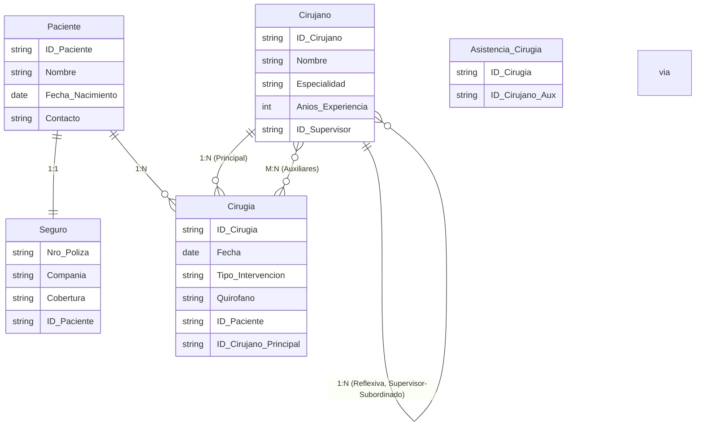

## Gestión de pacientes y médicos en un hospital

Un hospital necesita un sistema para gestionar pacientes, su historial médico y las cirugías que se les realizan. 

Cada paciente tiene un número de historia clínica único, nombre, fecha de nacimiento y datos de contacto. Algunos pacientes tienen una ficha de seguro médico particular que es única para ellos y siempre la tienen. Si no hay seguro asociado, el paciente no se registra en el sistema (todos los pacientes tienen seguro), la compañía aseguradora se guarda con número de póliza, nombre de la compañía y tipo de cobertura.

Los médicos del hospital pueden ser cirujanos especializados en diferentes procedimientos. Cada cirugía realizada queda registrada con un ID, fecha, tipo de intervención y el quirófano en el que se realizó. Una cirugía involucra necesariamente a un paciente y a un cirujano principal, pero un cirujano puede realizar muchas cirugías a lo largo del tiempo. Además, los cirujanos tienen un superior jerárquico (también cirujano) dentro del hospital: esto crea una relación jerárquica interna (un cirujano puede supervisar a varios cirujanos, pero cada cirujano tiene a lo sumo un supervisor).

Para ciertos procedimientos se involucran varios cirujanos auxiliares. Así, una cirugía puede tener un cirujano principal y varios cirujanos auxiliares.

Se pide identificar entidades, atributos, relaciones y luego el diagrama E-R.

Además, se pide indicar el código SQL para dar respuesta a las siguientes consultas:
- Obtener los cirujanos junto con el nombre de su supervisor.
- Listar las cirugías en las que un cirujano específico participó como auxiliar.


## Solución

<details>
<summary>Mostrar solución 😃</summary>

Entidades y atributos:

```
Paciente(ID_Paciente, Nombre, Fecha_Nacimiento, Contacto)
Seguro(Nro_Poliza, Compañía, Cobertura) [FK: ID_Paciente (1:1 con obligatoriedad en ambos lados)]
Cirujano(ID_Cirujano, Nombre, Especialidad, Años_Experiencia, ID_Supervisor(FK a ID_Cirujano, 0:1)) - relación reflexiva 1:N
Cirugía(ID_Cirugía, Fecha, Tipo_Intervención, Quirófano) [FK: ID_Paciente, ID_Cirujano(Principal)]
Entidades intermedias:
    Asistencia_Cirugía(ID_Cirugía, ID_Cirujano_Auxiliar) para la relación M:N entre Cirugía y Cirujano (auxiliares).
```

Relaciones:

```
Paciente 1:1 Seguro (1:1 con 1:1, un paciente tiene exactamente un seguro y un seguro pertenece a un único paciente)
Paciente 1:N Cirugía (Un paciente puede tener varias cirugías, cada cirugía asociada a un único paciente)
Cirujano (principal) 1:N Cirugía (Un cirujano puede ser principal en muchas cirugías, cada cirugía tiene un único principal)
Cirujano 1:N (reflexiva) Cirujano (Un cirujano puede supervisar a varios cirujanos, un cirujano tiene a lo sumo un supervisor)
Cirujano M:N (auxiliares) Cirugía a través de Asistencia_Cirugía
```
A continuación, se presenta el diagrama E-R correspondiente (el lenguaje mediante el que se representa es Mermaid y puedes visualizar el diagrama utilizando un [editor de Mermaid](https://mermaid.live/)):



Código SQL para las consultas:
Consulta 1:
```sql
SELECT c.Nombre AS Cirujano, sup.Nombre AS Supervisor
FROM Cirujano c
LEFT JOIN Cirujano sup ON c.ID_Supervisor = sup.ID_Cirujano;
```

Consulta 2:
```sql
SELECT ci.ID_Cirugia, ci.Fecha, ci.Tipo_Intervencion, ci.Quirofano
FROM Cirugia ci
JOIN Asistencia_Cirugia ac ON ci.ID_Cirugia = ac.ID_Cirugia
JOIN Cirujano c ON ac.ID_Cirujano_Aux = c.ID_Cirujano
WHERE c.Nombre = 'Dr. Pérez';
```

</details>
