## Registro de cursos en una universidad

Una universidad imparte cursos de grado y posgrado. Cada curso tiene un código único, título, nivel (grado/posgrado) y número de créditos. Hay profesores que dictan estos cursos. Un curso puede tener un profesor titular obligatorio (sin titular no se imparte el curso), pero algunos cursos también pueden tener un coordinador opcional (por ejemplo, un curso de proyecto final). El coordinador si existe es único y un profesor no siempre coordina un curso. Es decir, el curso puede existir sin coordinador, pero si hay coordinador es un único profesor y ese profesor coordina exactamente un curso.

Los estudiantes se inscriben a los cursos, pudiendo estar en varios al mismo tiempo. Algunos estudiantes pueden ser tutores entre ellos: un estudiante de nivel avanzado puede tutorizar a varios estudiantes, y un estudiante puede tener a lo sumo un tutor.

Se pide identificar entidades, atributos, relaciones y diagrama E-R.

Además, se pide indicar el código SQL para dar respuesta a las siguientes consultas:
- Obtener la lista de estudiantes con el nombre de su tutor.
- Listar los cursos que tienen coordinador y el nombre del coordinador.

## Solución

<details>
<summary>Mostrar solución 😃</summary>

Entidades y atributos:
```
Curso(Cod_Curso, Título, Nivel, Créditos)
Profesor(ID_Profesor, Nombre, Departamento)
Estudiante(ID_Estudiante, Nombre, Carrera, Año_Ingreso)
Entidades intermedias:
    Imparte(Cod_Curso, ID_Profesor) para indicar profesor titular (1:1 con obligatoriedad, el curso debe tener un titular, y un profesor puede ser titular de varios cursos)
    Coordinación(Cod_Curso, ID_Profesor) para la relación coordinador: 0:1 en el curso, pero 1:1 en el profesor (un profesor coordina a lo sumo un curso)
    Matrícula(Cod_Curso, ID_Estudiante) para relación M:N entre Estudiante y Curso
    Tutoría(ID_Tutor, ID_Tutorizado) para relación M:N reflexiva entre Estudiantes
```
Relaciones:
```
Curso 1:1 Profesor (Titular) a través de Imparte (con restricción: cada curso debe tener uno y solo un titular; un profesor puede titularizar más de un curso, por lo que es 1:N realmente, pero se expresa con la participación obligatoria del curso)
Curso 0:1 Profesor (Coordinador) a través de Coordinación (el curso puede no tener coordinador, pero si lo tiene, hay una correspondencia 1:1 con un profesor que no coordina otro curso)
Estudiante M:N Curso a través de Matrícula
Estudiante M:N (reflexiva) Estudiante a través de Tutoría (en realidad es 1:N desde el punto de vista de tutor-tutorizado, pero se modela con una entidad intermedia porque un tutor puede tener varios tutorizados y un estudiante puede, a lo largo del tiempo, tener un tutor distinto. Para simplificar, se asume M:N reflexiva.)
```

A continuación, se presenta el diagrama E-R correspondiente (el lenguaje mediante el que se representa es Mermaid y puedes visualizar el diagrama utilizando un [editor de Mermaid](https://mermaid.live/)):

```mermaid
erDiagram

    Curso {
        string Cod_Curso
        string Titulo
        string Nivel
        int Creditos
    }

    Profesor {
        string ID_Profesor
        string Nombre
        string Departamento
    }

    Estudiante {
        string ID_Estudiante
        string Nombre
        string Carrera
        date Anio_Ingreso
    }

    Imparte {
        string Cod_Curso
        string ID_Profesor
    }

    Coordinacion {
        string Cod_Curso
        string ID_Profesor
    }

    Matricula {
        string Cod_Curso
        string ID_Estudiante
    }

    Tutoria {
        string ID_Tutor
        string ID_Tutorizado
    }

    Curso ||--o{ Imparte : "1:1 (Curso a Profesor Titular)"
    Curso |o--|| Coordinacion : "0:1 (Curso a Profesor Coordinador)"
    Estudiante }o--o{ Curso : "M:N" via Matricula
    Estudiante }o--o{ Estudiante : "M:N Reflexiva (Tutoría)" via Tutoria

```



Nota: La relación titular (Imparte) es en realidad 1:N desde el profesor al curso (un profesor puede impartir varios cursos), pero el curso debe tener exactamente un profesor titular. La relación coordinador es 0:1 desde el curso a profesor (un curso puede no tener coordinador) y 1:1 desde el profesor (un profesor solo coordina un curso).

Código SQL para las consultas:
Consulta 1:
```sql
SELECT e2.Nombre AS Estudiante, e1.Nombre AS Tutor
FROM Tutoria t
JOIN Estudiante e1 ON t.ID_Tutor = e1.ID_Estudiante
JOIN Estudiante e2 ON t.ID_Tutorizado = e2.ID_Estudiante;
```

Consulta 2:
```sql
SELECT c.Titulo AS Curso, p.Nombre AS Coordinador
FROM Curso c
JOIN Coordinacion co ON c.Cod_Curso = co.Cod_Curso
JOIN Profesor p ON co.ID_Profesor = p.ID_Profesor;
```

</details>
