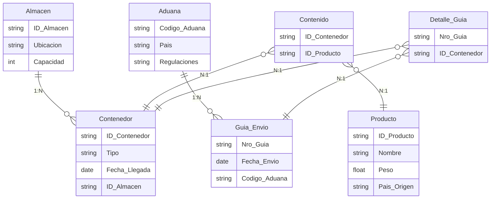

## Envíos de una empresa de logística

Una empresa de logística administra envíos internacionales. La empresa tiene varios Almacenes con un identificador único, ubicación y capacidad. En cada almacén se guardan Contenedores, cada contenedor tiene un código único, el tipo (refrigerado, seco, etc.) y fecha de llegada al almacén. Un almacén puede tener muchos contenedores, cada contenedor se almacena en un único almacén.

Los Productos se empaquetan y colocan en contenedores. Un producto tiene un código, nombre, peso y país de origen. Un contenedor puede tener varios productos y un producto puede estar en varios contenedores diferentes.

Para cada envío internacional, se crea una Guía de Envío con un número de guía, fecha de envío, y destino final. Una misma guía puede incluir contenedores de varios almacenes, y cada contenedor puede formar parte de varias guías a lo largo del tiempo. Además, existe una Aduana correspondiente al destino, que se identifica por un código, el país y las regulaciones asociadas. Una guía de envío se dirige a una sola aduana, pero una aduana recibe muchas guías.

Se pide identificar entidades, atributos, relaciones y diagrama E-R.

Además, se pide indicar el código SQL para dar respuesta a las siguientes consultas:
- Encontrar todos los productos transportados en una guía de envío específica.
- Listar los almacenes que contienen un determinado producto en sus contenedores.

## Solución

<details>
<summary>Mostrar solución 😃</summary>

Entidades y atributos:
```
Almacén(ID_Almacén, Ubicación, Capacidad)
Contenedor(ID_Contenedor, Tipo, Fecha_Llegada) [FK: ID_Almacén]
Producto(ID_Producto, Nombre, Peso, País_Origen)
Guía_Envío(Nro_Guía, Fecha_Envío) [FK: Código_Aduana]
Aduana(Código_Aduana, País, Regulaciones)
Entidades intermedias: 
    Contenido(ID_Contenedor, ID_Producto) para la relación M:N Contenedor-Producto
    Detalle_Guía(Nro_Guía, ID_Contenedor) para la relación M:N Guía_Envío - Contenedor
```
Relaciones:
```
Almacén 1:N Contenedor
Contenedor M:N Producto a través de Contenido
Guía_Envío M:N Contenedor a través de Detalle_Guía
Guía_Envío N:1 Aduana (Cada guía se dirige a una aduana, una aduana recibe muchas guías)
```
A continuación, se presenta el diagrama E-R correspondiente (el lenguaje mediante el que se representa es Mermaid y puedes visualizar el diagrama utilizando un [editor de Mermaid](https://mermaid.live/)):



Código SQL para las consultas:
Consulta 1:
```sql
SELECT p.Nombre, p.Pais_Origen
FROM Guia_Envio g
         JOIN Detalle_Guia dg ON g.Nro_Guia = dg.Nro_Guia
         JOIN Contenedor c ON dg.ID_Contenedor = c.ID_Contenedor
         JOIN Contenido co ON c.ID_Contenedor = co.ID_Contenedor
         JOIN Producto p ON co.ID_Producto = p.ID_Producto
WHERE g.Nro_Guia = 'G12345';
```

Consulta 2:
```sql
SELECT DISTINCT a.ID_Almacen, a.Ubicacion
FROM Almacen a
JOIN Contenedor cn ON a.ID_Almacen = cn.ID_Almacen
JOIN Contenido co ON cn.ID_Contenedor = co.ID_Contenedor
JOIN Producto pr ON co.ID_Producto = pr.ID_Producto
WHERE pr.Nombre = 'Café Colombiano';
```

</details>
