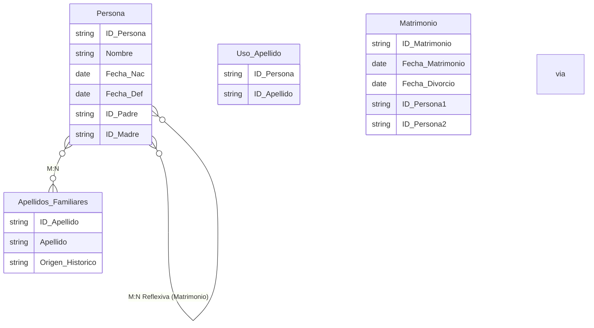

## Árbol Genealógico

Un sistema para administrar información genealógica de familias. Cada Persona tiene un ID, nombre, fecha de nacimiento, y opcionalmente una fecha de defunción. Una persona puede tener padre y madre registrados en el sistema. Un padre/madre puede tener muchos hijos, y un hijo tiene a lo sumo un padre y una madre registrados. A la vez, las personas pueden estar casadas. Una persona se puede haber casado múltiples veces (con diferentes personas a lo largo de la vida), y cada matrimonio vincula a exactamente dos personas. De cada matrimonio se guarda la fecha de matrimonio y, si aplica, fecha de divorcio.

Además, se registran los apellidos como una entidad separada, donde cada apellido tiene un origen histórico y se puede asociar a múltiples personas. Las personas pueden tener múltiples apellidos.

Se requiere identificar entidades, atributos, relaciones y el diagrama E-R.

Además, se pide indicar el código SQL para dar respuesta a las siguientes consultas:
- Obtener el nombre de cada persona junto con el de su padre y madre.
- Listar todos los matrimonios con el nombre de las dos personas involucradas.

## Solución

<details>
<summary>Mostrar solución 😃</summary>

Entidades y atributos:
```
Persona(ID_Persona, Nombre, Fecha_Nac, Fecha_Def)
Apellidos_Familiares(ID_Apellido, Apellido, Origen_Histórico)
Entidades intermedias: 
    Matrimonio(ID_Matrimonio, Fecha_Matrimonio, Fecha_Divorcio) [relaciona 2 Personas] 
    Uso_Apellido(ID_Persona, ID_Apellido) para M:N Personas - Apellidos
```
Relaciones:
```
Persona 1:N reflexiva (paternidad/maternidad): Una persona puede ser padre/madre de muchas personas, cada persona tiene a lo sumo 1 padre y 1 madre. (Se puede modelar con dos FK a Persona: ID_Padre, ID_Madre, ambos opcionales)
Persona M:N reflexiva (matrimonio) a través de Matrimonio: Cada Matrimonio vincula dos Personas.
Persona M:N Apellidos_Familiares a través de Uso_Apellido.
```
A continuación, se presenta el diagrama E-R correspondiente (el lenguaje mediante el que se representa es Mermaid y puedes visualizar el diagrama utilizando un [editor de Mermaid](https://mermaid.live/)):


Nota: Para la relación de paternidad/maternidad, se utilizan los atributos ID_Padre e ID_Madre dentro de Persona. Mermaid no muestra esto con líneas directas, pero conceptualmente es una relación reflexiva.

Código SQL para las consultas:
Consulta 1:
```sql
SELECT c.Nombre AS Hijo,
       p.Nombre AS Padre,
       m.Nombre AS Madre
FROM Persona c
LEFT JOIN Persona p ON c.ID_Padre = p.ID_Persona
LEFT JOIN Persona m ON c.ID_Madre = m.ID_Persona;
```

Consulta 2:
```sql
SELECT mat.ID_Matrimonio,
       p1.Nombre AS Conyuge1,
       p2.Nombre AS Conyuge2
FROM Matrimonio mat
JOIN Persona p1 ON mat.ID_Persona1 = p1.ID_Persona
JOIN Persona p2 ON mat.ID_Persona2 = p2.ID_Persona;
```

</details>
