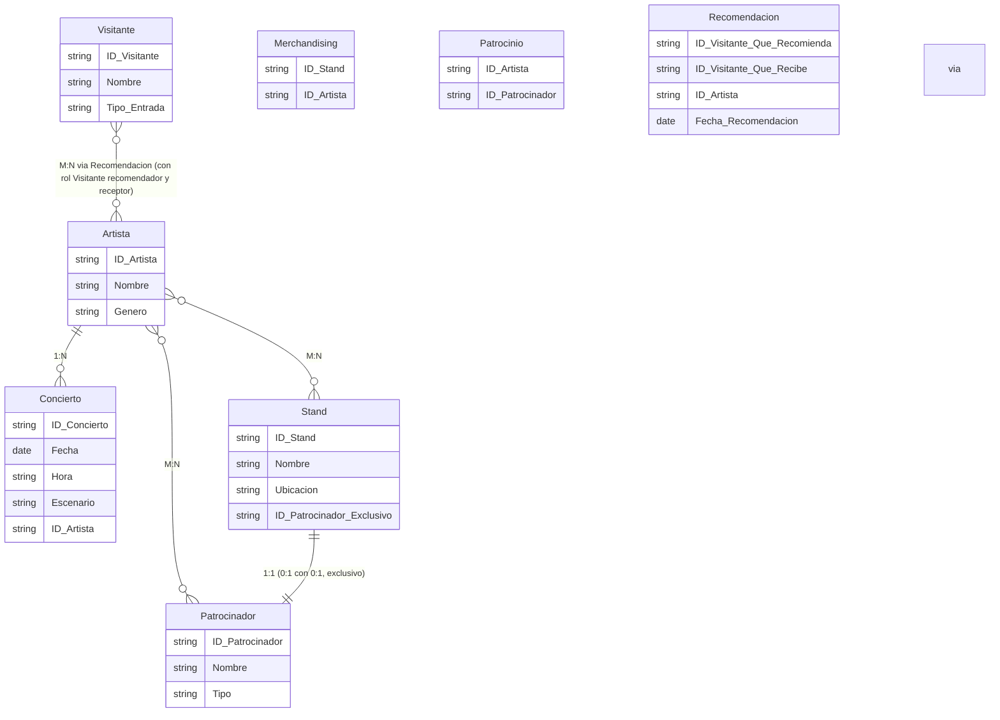

## Festival de Música

UNIR organiza un festival anual de música. Hay Artistas (bandas o solistas) con un ID, nombre, género musical. Cada artista ofrece uno o varios Conciertos en el festival, cada concierto con un ID, fecha, hora y escenario. Un concierto está asociado a un solo artista, pero un artista puede dar múltiples conciertos.

El festival tiene Patrocinadores (empresas) con un código, nombre, tipo de patrocinio. Un patrocinador puede patrocinar a varios artistas, y un artista puede tener múltiples patrocinadores.

Los Stands de Venta en el recinto ofrecen merchandising. Cada stand tiene un ID, nombre, ubicación. Un stand puede vender productos de varios artistas, y un artista puede tener merchandising en varios stands. Además, ciertos stands pueden ser exclusivos de un solo patrocinador, mientras que otros no tienen patrocinador. Si existe patrocinador exclusivo, es un único patrocinador por stand, y ese patrocinador no patrocina otro stand en exclusividad.

También se registran Visitantes con un ID, nombre, y tipo de entrada (general, VIP, etc.). Los visitantes pueden recomendarse mutuamente artistas: un visitante puede recomendarle a otro visitante uno o varios artistas, pero esta recomendación se registra de forma que se sepa quién recomendó a quién.

Se pide identificar entidades, atributos, relaciones y diagrama E-R.

Además, se pide indicar el código SQL para dar respuesta a las siguientes consultas:
- Listar todas las recomendaciones donde un visitante recomienda un artista a otro visitante.
- Listar los stands que tienen un patrocinador exclusivo.

## Solución

<details>
<summary>Mostrar solución 😃</summary>

Entidades y atributos:
```
Artista(ID_Artista, Nombre, Género)
Concierto(ID_Concierto, Fecha, Hora, Escenario) [FK: ID_Artista]
Patrocinador(ID_Patrocinador, Nombre, Tipo)
Stand(ID_Stand, Nombre, Ubicación, ID_Patrocinador_Exclusivo (FK opcional))
Visitante(ID_Visitante, Nombre, Tipo_Entrada)
Recomendación(ID_Visitante_Que_Recomienda, ID_Visitante_Que_Recibe, ID_Artista, Fecha_Recomendación)
Entidades intermedias:
    Merchandising(ID_Stand, ID_Artista) para M:N entre Stand y Artista
    Patrocinio(ID_Artista, ID_Patrocinador) para M:N entre Artista y Patrocinador
```

Relaciones:
```
Artista 1:N Concierto
Artista M:N Patrocinador a través de Patrocinio
Artista M:N Stand a través de Merchandising
Stand 0:1 Patrocinador (exclusivo) (1:1 (0:1 con 0:1)) - Stand puede no tener patrocinador exclusivo, y patrocinador puede no tener stand exclusivo
Visitante M:N Artista a través de Recomendación (en realidad es una relación ternaria Visitante-Visitante-Artista, pero se modela con dos Visitantes en la entidad Recomendación, diferenciando roles)
```
A continuación, se presenta el diagrama E-R correspondiente (el lenguaje mediante el que se representa es Mermaid y puedes visualizar el diagrama utilizando un [editor de Mermaid](https://mermaid.live/)):



Código SQL para las consultas:
Consulta 1:
```sql
SELECT vr.Nombre AS Recomienda, vq.Nombre AS Recibe, a.Nombre AS Artista
FROM Recomendacion r
JOIN Visitante vr ON r.ID_Visitante_Que_Recomienda = vr.ID_Visitante
JOIN Visitante vq ON r.ID_Visitante_Que_Recibe = vq.ID_Visitante
JOIN Artista a ON r.ID_Artista = a.ID_Artista;
```

Consulta 2:
```sql
SELECT s.ID_Stand, s.Nombre AS Stand, p.Nombre AS Patrocinador
FROM Stand s
JOIN Patrocinador p ON s.ID_Patrocinador_Exclusivo = p.ID_Patrocinador;
```

</details>
