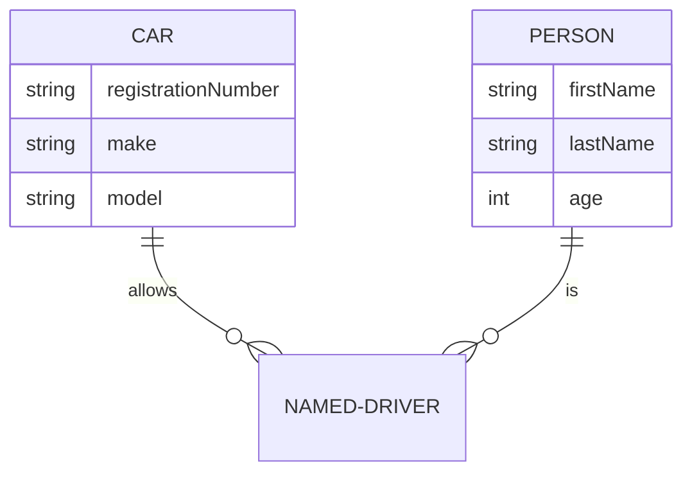

## Ejercicios de repaso de modelado de datos

En esta sección se presentan ejercicios de modelado de datos que abarcan los temas vistos en la asignatura de segundo curso "Bases de Datos" del Grado en Ingeniería Informática de UNIR. En cualquier caso, siéntente libre de realizarlos para refrescar conceptos.

Para cada ejercicio, se presenta un enunciado junto con una posible solución (se recomienda mirarla tras haber intentado solucionar el problema) y se pide realizar lo siguiente:
- Identificar entidades y atributos.
- Identificar relaciones.
- Realizar el diagrama E-R correspondiente a través de un editor de [Mermaid](https://mermaid.js.org/). En su [documentación](https://mermaid.js.org/syntax/entityRelationshipDiagram.html) puedes encontrar información sobre cómo realizar diagramas E-R.

Se recomienda utilizar un editor en línea como [este](https://mermaid.live/).
Prueba a incluir este código y verás como se genera un diagrama E-R:

Los ejercicios propuestos son los siguientes:

- [Editoral de libros y revistas](00_Resources/01_Editorial.md): Dificultad: ⭐⭐⭐️
- [Gestión de hospitales](00_Resources/02_Hospitales.md): Dificultad: ⭐⭐⭐
- [Cursos y mentores de universidad](00_Resources/03_Universidad.md): Dificultad: ⭐⭐⭐⭐
- [Envío de mercancías](00_Resources/04_Mercancias.md): Dificultad: ⭐⭐
- [Árbol genealógico](00_Resources/05_Genealogia.md): Dificultad: ⭐⭐⭐⭐
- [Festival de música](00_Resources/06_Festival.md): Dificultad: ⭐⭐⭐⭐⭐